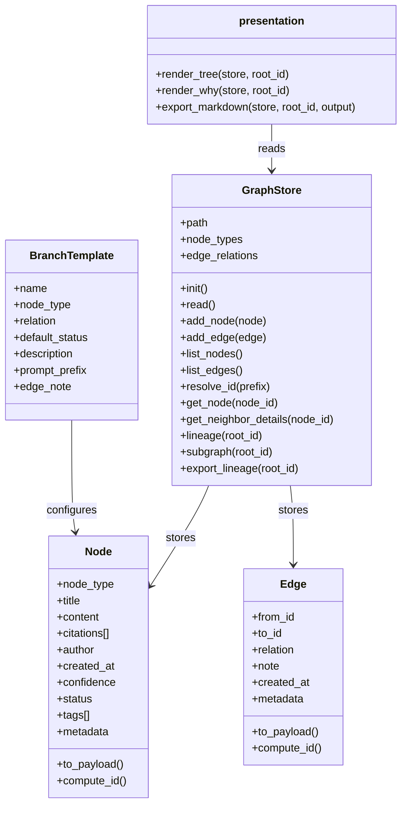
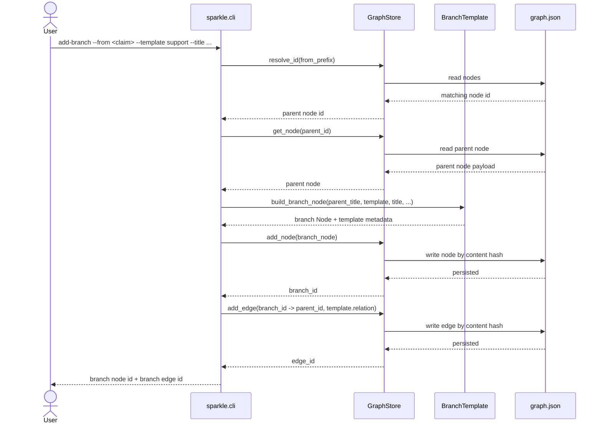
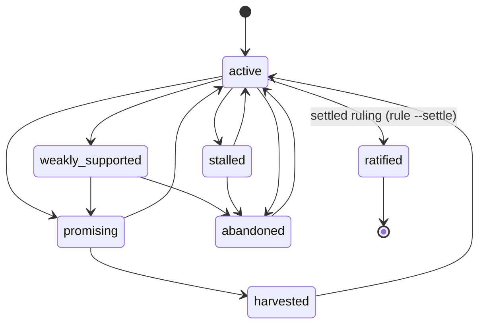

# ✨ Sparkle

A research tool that makes claims, evidence, and reasoning traceable — for humans and AI agents.

Instead of scattering research across notes, bookmarks, and chat threads, Sparkle stores it as a typed graph: claims link to evidence, objections, questions, and syntheses. Every conclusion traces back to the path that produced it. Nothing gets lost.

**[See it in action: Does music help you code?](demo/)**

## Why This Exists

Most research tools are good at capture and bad at accountability. Ask yourself:

- What supports this claim? What weakens it?
- What alternative paths did I explore?
- Why did I abandon that line of thinking?
- How exactly did I arrive at this conclusion?

If you can't answer those from your notes, you have a capture tool, not a research tool. Sparkle is the graph layer that makes these questions answerable — by you, by a collaborator reviewing your work, or by an AI agent conducting research on your behalf.

## Where It's Going

Three ways to operate the graph work today. A human drives it from the CLI. An AI agent in Claude Code or Claude Desktop drives it interactively over the MCP server, with the host's own model supplying all the thinking (no server-side model, no API key — see "Intelligent operation" below). And a fully hands-off loop drives it via `sparkle run`, where a *proposer*, a *different-model critic*, and a *judge* debate a seed question with no human in the turn order (see "Autonomous Operation" below).

What's left:

| Phase | What | Why |
|-------|------|-----|
| **Real citations** | Structured sources, excerpts, DOI/URL, BibTeX interop | Flat strings aren't verifiable sources |
| **Deeper introspection** | `gaps`, `tensions`, `stale`, `orphans` as first-class commands | Tell an agent what to work on next without reading the whole graph |
| **Machine-readable CLI** | `--format json` on every command | Drive Sparkle from scripts without going through MCP |

See [`docs/roadmap.md`](docs/roadmap.md) for the full plan.

## Quick Start

```bash
git clone <repo> && cd sparkle

# Optional: install the `sparkle` console command, then drop the PYTHONPATH prefix
pip install -e .   # afterwards you can run `sparkle init`, `sparkle home`, etc.

# Initialize a graph store
PYTHONPATH=src python3 -m sparkle init

# Seed with an example graph
PYTHONPATH=src python3 -m sparkle bootstrap

# See the dashboard
PYTHONPATH=src python3 -m sparkle home

# Explore
PYTHONPATH=src python3 -m sparkle tree <node_id_prefix>
PYTHONPATH=src python3 -m sparkle show <node_id_prefix>
PYTHONPATH=src python3 -m sparkle why <node_id_prefix>
```

Or explore the pre-built demo graph:

```bash
PYTHONPATH=src python3 -m sparkle --store demo/.sparkle/graph.json home
PYTHONPATH=src python3 -m sparkle --store demo/.sparkle/graph.json tree e036ff896cea
```

## Intelligent Operation (MCP)

Sparkle ships an MCP server so an AI agent can operate the graph natively — no shelling out, no ASCII parsing. Today this works **interactively** on Claude Code and Claude Desktop: you run a slash-command prompt, the host's own model reads a "where is the debate weak right now" feed, reasons about it, and calls mutation tools to write objections, evidence, and rulings back into the graph. The server supplies structure, targets, and guardrails; the host model supplies all the thinking. No server-side model and no API key.

```bash
pip install 'sparkle[mcp]'                 # adds the MCP SDK; the core stays dependency-free
claude mcp add sparkle -- sparkle mcp       # register the server with a client
```

The `sparkle mcp` command runs the server over stdin/stdout. It is a lazy seam: every other command works without the extra installed, and a missing extra fails with a clear `pip install 'sparkle[mcp]'` message.

What the server exposes:

- **A work frontier** (`sparkle://frontier`, also a tool) — a prioritized "what needs adversarial attention next" feed computed purely from the stored graph: unchallenged claims, open questions, stalled threads, thin-evidence claims, and claims ready to judge. Live, non-persisted aggregates (a supports-minus-contradicts tally plus node type/status), never the frozen stored confidence.
- **Mutation tools** that enforce debate rules the raw CLI doesn't — for example, the judge's "rule" move refuses to ratify a claim the adversary never attacked.
- **Adversarial prompts** as slash commands: `/challenge` (cast the model as critic), `/investigate` (evidence-gatherer), `/synthesize` (judge then synthesizer), `/next` (read the frontier and run the highest-leverage move).

The guardrails live in the shared operations layer (`ops.py`), not in the MCP wrapper, so the CLI, the MCP server, and the autonomous harness all inherit the same rules through the same error boundary. The hands-off, no-human-in-the-loop version is described next.

## Autonomous Operation (`sparkle run`)

The MCP path still needs a human to take turns with the model. The autonomous harness removes the human from the turn order entirely: one command, `sparkle run "<seed question>"`, walks the same adversarial playbook unattended — a *proposer* states a claim, a *critic* attacks it, an *evidence gatherer* adds support and counter-evidence, a *judge* rules, and a *synthesizer* harvests the takeaway.

The reason this exists is an integrity weakness the interactive path can't fully close. The "was this claim challenged?" gate only checks that an objection *exists*; it can't tell whether the objection came from a real opponent or from the same model writing a strawman against itself. The harness makes the adversary real along two axes:

- **A different model per role.** The proposer, critic, and judge are separate model calls with separate contexts and distinct author identities. By default the critic runs on a *different* Claude model than the proposer (proposer = `claude-opus-4-8`, critic = `claude-sonnet-4-6`, judge = `claude-opus-4-8`), so the attack is not the proposer's own reasoning rephrased. The per-role models are env-configurable (`SPARKLE_PROPOSER_MODEL` / `SPARKLE_CRITIC_MODEL` / `SPARKLE_JUDGE_MODEL`); the one locked invariant — enforced at config construction — is that the critic model must differ from the proposer model.
- **A distinct-adversary ratification floor.** The judge's ruling move turns on a stricter gate (`require_distinct_adversary`) that the human CLI path leaves off: a claim can only be ratified if at least one objection against it was written by a *different author* than the claim's own author. A self-written objection can no longer ratify a claim. The harness also adds an engine-side check that the objecting author maps to a *different model* than the claim's author, so a role with a distinct name but the proposer's model can't sneak a self-attack through. This floor lives in the shared operations layer, so every front-end inherits it; the harness simply turns it on. (A self-loop `contradicts` edge — a claim pointing its own objection at itself — is now banned outright at the edge-write boundary, since it can never be a real attack.)

```bash
pip install 'sparkle[agents]'                       # adds the Anthropic SDK; the core stays dependency-free
export ANTHROPIC_API_KEY=sk-ant-...                 # the live debate uses your own key
PYTHONPATH=src python3 -m sparkle run "Does music help you code?"
```

`sparkle run` is a lazy seam, exactly like `sparkle mcp`: the autonomous code is only imported when you invoke `run`, and a missing extra fails with a clear `pip install 'sparkle[agents]'` hint. Every graph mutation the loop makes goes through the same `ops.py` functions the CLI and MCP server use, stamped with a `run_id` so the whole run is visible to the run-summary / diff / rollback surface, so the loop inherits all the debate invariants by construction.

What this does **not** claim:

- **The live three-model debate needs the `sparkle[agents]` extra and an `ANTHROPIC_API_KEY`.** Only `sparkle run` touches the network. The model backend (the Anthropic SDK) is imported lazily inside one module and never enters the zero-dependency core, the CLI core, or the MCP server.
- **The automated tests cover the engine through a deterministic stub, not live API calls.** The harness loop, the distinct-adversary floor, the self-loop ban, the run-id plumbing, and the stop conditions are all proven in the stdlib test suite with a scripted stub thinker — no network, no key. The live three-model debate is a manual acceptance step for a human, not something the test suite validates.

## How It Works

### The graph model

Research is a graph of typed nodes connected by typed edges:

- **Nodes**: `claim`, `evidence`, `question`, `objection`, `inference`, `decision`, `synthesis`
- **Edges**: `supports`, `contradicts`, `refines`, `derived_from`, `evaluates`, `produced`, `supersedes` (the CLI validates against this set; the Python kernel accepts custom relation sets)
- **Status**: `active`, `stalled`, `weakly_supported`, `promising`, `abandoned`, `harvested`, `ratified` (terminal — a judge's binding ruling; only a settled ruling can write it)
- **IDs**: SHA256 content hashes — same content always produces the same ID, tamper-evident by construction

### Branch templates

Recurring research moves have templates so you don't have to remember node types and relations:

| Template | Creates | Relation | Use when |
|----------|---------|----------|----------|
| `support` | evidence | supports | Adding evidence for a claim |
| `objection` | objection | contradicts | Challenging a claim |
| `reframing` | question | refines | Asking a better question |
| `application` | claim | derived_from | Drawing a practical conclusion |

```bash
PYTHONPATH=src python3 -m sparkle add-branch \
  --from <claim_id> --template support \
  --title "Primary source evidence" \
  --citations "https://example.com/paper"
```

### Storage

All state lives in a single human-readable JSON file (`.sparkle/graph.json`). Nodes and edges are keyed by content hash. Identical payloads collapse to the same ID. The store is immutable in spirit — provenance remains stable as the graph grows.

## CLI Reference

| Command | What it does |
|---------|-------------|
| `init` | Create an empty graph store |
| `bootstrap` | Seed with example nodes from the concept conversation |
| `home` | Dashboard with counts, recent nodes, next actions |
| `add-node` | Create a node with type, title, content, confidence (validated to 0.0-1.0), status, tags; optionally fuse a link in one call (`--link-to <prefix> --relation <rel>`) and register a name (`--as <name>`) |
| `add-edge` | Link two nodes with a relation (validated against the known relation set); endpoints accept ids, short prefixes, or alias names |
| `add-branch` | Templated node + edge creation for common research moves |
| `revise` | Supersede a node with a corrected version and re-home its inbound edges — model-honest editing that never mutates the frozen original (`--no-rehome-edges` to leave edges on the old version) |
| `import` | Build a graph fragment from a JSON document (file path or `-` for stdin); prints a nickname-to-id map. The LLM/batch on-ramp |
| `list-nodes` | List nodes through a single unified filter (type, status, tag, query, limit); `--ids-only` prints bare handles for fast scanning before linking |
| `list-edges` | List all edges |
| `list-templates` | Show available branch templates |
| `relations` | Show each edge relation with a plain-English direction gloss |
| `show` | Inspect a node with all its incoming and outgoing edges |
| `tree` | ASCII tree of a node's immediate neighborhood |
| `why` | Trace inbound provenance chain |
| `lineage` | Walk all inbound ancestors (BFS) |
| `export` | Export a subgraph rooted at a node to markdown |
| `mcp` | Run the MCP server over stdin/stdout (requires the `sparkle[mcp]` extra) |
| `run` | Run the autonomous adversarial loop on a seed question — proposer, different-model critic, and judge debate unattended (requires the `sparkle[agents]` extra and `ANTHROPIC_API_KEY`); `--rounds` overrides the critique/gather caps, `--max-moves` sets the runaway backstop |

All commands accept `--store <path>` to use a non-default graph file.

After every add, Sparkle echoes a short 12-character handle on its own `Handle:` line (so you stop copying 64-character hashes) and a spoken-word link confirmation (`Linked: evidence "X" --supports--> claim "Y"`) so you catch a backwards edge at a glance. Use explicit short prefixes or alias names when linking; there is deliberately no "last node" token, because whole-second timestamps have no tiebreaker and would silently attach an edge to the wrong node.

## Architecture

### Source layout

```
src/sparkle/
  __init__.py       # package marker, re-exports the reusable graph kernel
  models.py         # Node, Edge — frozen dataclasses with content-addressed IDs
  graph.py          # GraphStore — JSON-backed storage, traversal, subgraph, lineage export
  ops.py            # the operations contract — every action as a function returning dicts;
                    #   debate invariants, referee/transition engine, dedup gate, alias sidecar,
                    #   frontier, file lock. The single surface every front-end calls.
  cli.py            # CLI — a thin formatter; each command makes one ops.py call and prints
  mcp_server.py     # MCP server — a thin FastMCP adapter over ops.py (only loaded with the extra)
  harness.py        # autonomous engine + per-role agents + thinker contract + config;
                    #   drives the playbook via ops.* only — imports ops + stdlib, never anthropic
  thinker.py        # the live model backend — the ONLY module that names anthropic, imported
                    #   lazily; satisfies the harness's thinker contract (only loaded with the extra)
  presentation.py   # render_tree, render_why, export_markdown — read-only rendering over a store
  templates.py      # BranchTemplate — opinionated inquiry workflows
  bootstrap.py      # seeds example graph from concept conversation
  __main__.py       # python -m sparkle entrypoint
tests/
  test_cli.py       # CLI integration tests via unittest
  test_referee.py   # referee/transition engine + edge tally
  test_debate_loop.py   # end-to-end debate loop over ops
  test_runs.py      # run tagging, summary, diff, rollback
  test_mcp_server.py    # MCP adapter (skips when the mcp extra is absent)
  test_identity_rule.py # self-loop contradicts ban + distinct-adversary ratification floor
  test_run_plumbing.py  # run_id threaded through add-branch and rule
  test_harness.py   # autonomous engine driven by a deterministic stub thinker (no network, no key)
demo/
  README.md         # demo overview with mermaid graph
  WALKTHROUGH.md    # conversational walkthrough of building a claim graph
  exported-research.md  # sparkle export output
  .sparkle/graph.json   # the demo graph (17 nodes, 19 edges)
docs/
  prd.md            # product requirements
  roadmap.md        # what's built, what's next
```

The `ops.py` seam is the structural keystone: the CLI never touches the store directly, and neither does the MCP server or the autonomous harness. All three bottom out in the same functions behind one `ValueError` boundary, so the debate rules — including the distinct-adversary ratification floor and the self-loop ban — are enforced in exactly one place and the front-ends stay interchangeable. The two optional extras only pull their own dependency: `sparkle[mcp]` adds the MCP SDK and `sparkle[agents]` adds the Anthropic SDK (named only inside `thinker.py`, imported lazily). The core, the CLI core, and the MCP server stay pure stdlib with zero external dependencies.

### Diagrams

<details>
<summary>Class model</summary>


</details>

<details>
<summary>Add-branch sequence</summary>


</details>

<details>
<summary>Node status model</summary>



`ratified` is a terminal status reached only through a settled judge's ruling, never set freehand. Because nodes are frozen, ratification is realized model-honestly: the ruling writes a decision node and a *superseding* claim version carrying `status=ratified` and a `supersedes` edge to the original — never an in-place mutation. `harvested` and `abandoned` are likewise terminal in spirit; a model-authored write may not set any of the three directly.
</details>

## Testing

```bash
python3 -m unittest discover -s tests -v
```

The base suite is pure stdlib `unittest` with no third-party packages installed; run it from the repo root. It covers: init, bootstrap, node/edge CRUD, branch templates, show/tree/why rendering, filtered listing (type/status/tag/query/limit), `list-nodes --ids-only`, home dashboard, lineage, markdown export, content-addressing idempotency, custom node-type/relation graph kernels with metadata, lineage-only vs full-component export, `n/a` confidence rendering, dangling-edge export safety, corrupt-store handling, error handling (invalid lookups, ambiguous prefixes, unknown relations, out-of-range confidence), the operations layer (the `ratified` terminal status, the fused create-and-link path including the paired-or-error guard, alias registration and re-pointing on reuse, the ruling invariant that refuses to ratify an unchallenged claim, the content-fingerprint dedup gate, JSON import from stdin with invalid-JSON rejection, `revise` with and without re-homing inbound edges, the referee/transition engine, and run tagging/summary/diff/rollback), and the Phase 2 autonomous harness:

- **Distinct-adversary floor** (`test_identity_rule.py`): the self-loop `contradicts` ban at the edge-write boundary, and the `require_distinct_adversary` ratification gate — refused when the only objection's author equals the claim's author, allowed when a different author objects.
- **Run-id plumbing** (`test_run_plumbing.py`): a `run_id` threaded through `add-branch` and `rule` shows up on the objection and the ruling, so a full autonomous loop is captured by the run-summary surface.
- **Autonomous engine** (`test_harness.py`): a deterministic stub thinker (no network, no key) drives the full propose -> object -> rule loop; the run summary shows the claim, objection, and decision; the judge is refused on a self-strawman and succeeds with a distinct critic; the hard move cap and the `done`/`stop` move both end the loop; and `HarnessConfig` raises when the critic model equals the proposer model.

The MCP adapter tests (`test_mcp_server.py`) skip when the `sparkle[mcp]` extra is absent. No test makes a live Anthropic API call — the live three-model debate is a manual acceptance step.

## Current Limits

- The live three-model debate needs a key — `sparkle run` requires the `sparkle[agents]` extra and an `ANTHROPIC_API_KEY`. The autonomous engine itself is proven only against a deterministic stub thinker; the network path is a manual acceptance step, not something the test suite exercises.
- One front-end at a time per graph — an advisory file lock guards each read-modify-write, but there is no multi-writer guarantee beyond that.
- Citations are flat strings — no structured source metadata
- No first-class introspection commands — the frontier covers "what needs attention" via MCP, but `gaps`/`tensions`/`stale`/`orphans` are not yet standalone CLI commands
- No UI — terminal only
- Semantic dedup is out of scope — exact-fingerprint re-proposals auto-dedup, but near-duplicates are not detected (true fuzzy matching would force a model dependency)
