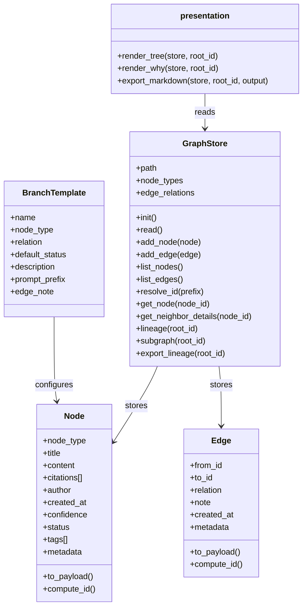
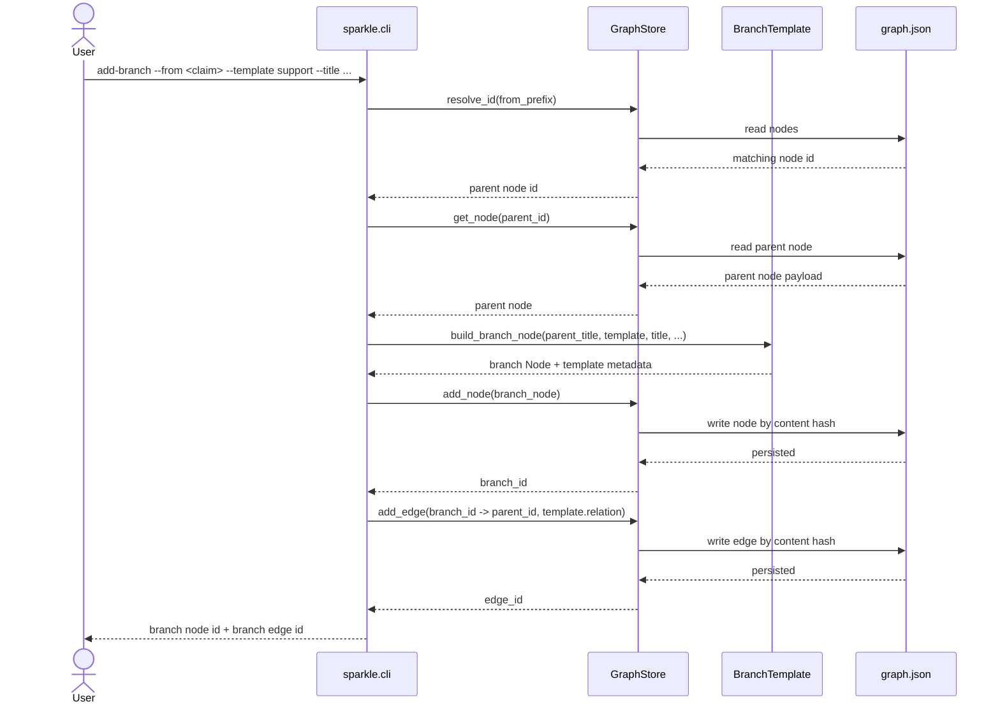
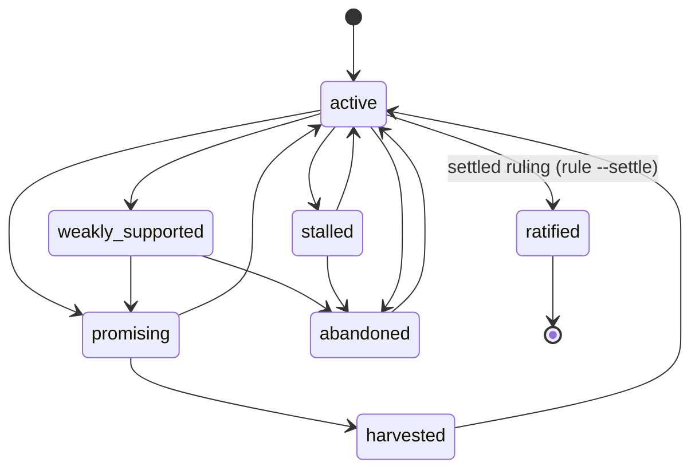

# ✨ Sparkle

A research tool that makes claims, evidence, and reasoning traceable — for humans and AI agents.

Instead of scattering research across notes, bookmarks, and chat threads, Sparkle stores it as a typed graph: claims link to evidence, objections, questions, and syntheses. Every conclusion traces back to the path that produced it. Nothing gets lost.

**[See it in action: Does music help you code?](demo/)**

## Why This Exists

Most research tools are good at capture and bad at accountability. Ask yourself:

- What supports this claim? What weakens it?
- What alternative paths did I explore?
- Why did I abandon that line of thinking?
- How exactly did I arrive at this conclusion?

If you can't answer those from your notes, you have a capture tool, not a research tool. Sparkle is the graph layer that makes these questions answerable — by you, by a collaborator reviewing your work, or by an AI agent conducting research on your behalf.

## Where It's Going

Three ways to operate the graph work today, and the main one is an AI agent. In Claude Code or Claude Desktop, an agent drives the graph interactively over the MCP server, with the host's own model supplying all the thinking — no server-side model, no API key (see "Intelligent Operation" below). A human can also drive it directly from the CLI. And a fully hands-off loop drives it via `sparkle run`, where Claude proposes and judges while a *different AI from another company* attacks, debating a seed question with no human in the turn order (see "Autonomous Operation" below). That loop reaches the models through the `claude` and `codex` command-line tools you already have logged in, so it too needs no API key.

What's left:

| Phase | What | Why |
|-------|------|-----|
| **Real citations** | Structured sources, excerpts, DOI/URL, BibTeX interop | Flat strings aren't verifiable sources |
| **Deeper introspection** | `gaps`, `tensions`, `stale`, `orphans` as first-class commands | Tell an agent what to work on next without reading the whole graph |
| **Machine-readable CLI** | `--format json` on every command | Drive Sparkle from scripts without going through MCP |

See [`docs/roadmap.md`](docs/roadmap.md) for the full plan.

## Quick Start

Requires Python 3.11+ and nothing else — the core is pure standard library. The main way to use Sparkle is to let an AI agent drive the graph over MCP; the CLI is there when you want to seed, inspect, or steer it by hand.

### Let an AI agent drive it (the primary path)

```bash
git clone https://github.com/albeorla/sparkle.git && cd sparkle
pip install -e '.[mcp]'                  # core + the MCP server

sparkle init                             # create a graph store
claude mcp add sparkle -- sparkle mcp    # register the server with Claude Code
```

Now ask your agent to work the graph. "What's the weakest part of the debate right now?" pulls the live work frontier; the `/challenge`, `/investigate`, `/synthesize`, and `/next` slash commands run the adversarial moves. The host's own model does all the reasoning — no server-side model, no API key. Full details in [Intelligent Operation](#intelligent-operation-mcp).

### Drive it yourself from the CLI

```bash
pip install -e .             # core only — drop the [mcp] extra

sparkle bootstrap           # seed an example graph
sparkle home                # dashboard with counts and next actions

# Explore any node by a short id prefix
sparkle tree <node_id_prefix>
sparkle show <node_id_prefix>
sparkle why  <node_id_prefix>
```

Prefer not to install? Every command also runs from the source tree — swap `sparkle <cmd>` for `PYTHONPATH=src python3 -m sparkle <cmd>`.

Explore the pre-built demo graph without touching your own:

```bash
sparkle --store demo/.sparkle/graph.json home
sparkle --store demo/.sparkle/graph.json tree e036ff896cea
```

## Intelligent Operation (MCP)

Sparkle ships an MCP server so an AI agent can operate the graph natively — no shelling out, no ASCII parsing. Today this works **interactively** on Claude Code and Claude Desktop: you run a slash-command prompt, the host's own model reads a "where is the debate weak right now" feed, reasons about it, and calls mutation tools to write objections, evidence, and rulings back into the graph. The server supplies structure, targets, and guardrails; the host model supplies all the thinking. No server-side model and no API key.

```bash
pip install 'sparkle[mcp]'                 # adds the MCP SDK; the core stays dependency-free
claude mcp add sparkle -- sparkle mcp       # register the server with a client
```

The `sparkle mcp` command runs the server over stdin/stdout. It is a lazy seam: every other command works without the extra installed, and a missing extra fails with a clear `pip install 'sparkle[mcp]'` message.

What the server exposes:

- **A work frontier** (`sparkle://frontier`, also a tool) — a prioritized "what needs adversarial attention next" feed computed purely from the stored graph: unchallenged claims, open questions, stalled threads, thin-evidence claims, and claims ready to judge. Live, non-persisted aggregates (a supports-minus-contradicts tally plus node type/status), never the frozen stored confidence.
- **Mutation tools** that enforce debate rules the raw CLI doesn't — for example, the judge's "rule" move refuses to ratify a claim the adversary never attacked.
- **Adversarial prompts** as slash commands: `/challenge` (cast the model as critic), `/investigate` (evidence-gatherer), `/synthesize` (judge then synthesizer), `/next` (read the frontier and run the highest-leverage move).

The guardrails live in the shared operations layer (`ops.py`), not in the MCP wrapper, so the CLI, the MCP server, and the autonomous harness all inherit the same rules through the same error boundary. The hands-off, no-human-in-the-loop version is described next.

## Autonomous Operation (`sparkle run`)

The MCP path still needs a human to take turns with the model. The autonomous harness removes the human from the turn order entirely: one command, `sparkle run "<seed question>"`, walks the same adversarial playbook unattended — a *proposer* states a claim, a *critic* attacks it, an *evidence gatherer* adds support and counter-evidence, a *judge* rules, and a *synthesizer* harvests the takeaway.

The reason this exists is an integrity weakness the interactive path can't fully close. The "was this claim challenged?" gate only checks that an objection *exists*; it can't tell whether the objection came from a real opponent or from the same model writing a strawman against itself. The harness makes the adversary real by pitting *two different AI companies' models* against each other, which it reaches through command-line tools rather than a paid API:

- **Claude proposes and judges; a GPT model attacks.** Each debate role is a separate AI call with its own context and a distinct author identity. Claude (Opus 4.8, reached through the `claude` command-line tool on your Claude Max login) plays the proposer, the judge, the evidence gatherer, and the synthesizer. The critic — the role whose whole job is to attack the claim — is OpenAI's GPT-5.5, reached through the `codex` command-line tool on your Codex/ChatGPT login. Real adversarial diversity comes from *different model families* (Claude vs GPT), not from running two tiers of the same Claude model, so every Claude-side role uses the same Opus 4.8 and the genuine opponent is the GPT critic. Each role's model family and model id are env-overridable (e.g. `SPARKLE_CRITIC_BACKEND`, `SPARKLE_CRITIC_MODEL`), and the codex side's reasoning effort can be tuned with `SPARKLE_CODEX_REASONING_EFFORT`.
- **It runs on your subscriptions, not an API bill.** The loop never imports a model SDK or reads an API key — it shells out to the `claude` and `codex` binaries you already have logged in. `claude -p` rides your Claude Max subscription and `codex exec` rides your Codex/ChatGPT subscription, so the spend comes out of those, not a per-token API bill. Each call runs in a throwaway empty directory with no tools granted, so the model can answer but can't read or touch this repo while it thinks.
- **A cross-family integrity gate.** Before the judge is allowed to ratify a claim, the engine requires that at least one objection against it came from a *different model family* than the claim's author (Claude vs GPT) — not merely a different author name. This is stronger than the shared "different author" floor in the operations layer (which the harness also turns on): a role with a distinct name but the same model family (say, a Claude-side evidence gatherer writing a counter-point against a Claude-authored claim) does *not* satisfy the gate, so a model can't ratify its own claim off an attack it effectively wrote. The one locked configuration rule — checked when the run is set up — is that the critic must be a different family than the proposer.
- **Rewrite, re-challenge.** When a claim is revised, its old objections are copied onto the new version for lineage and display, but those copied-over objections are *tagged as carried-over* and no longer count toward the gate. A rewritten claim therefore has to earn a fresh, genuinely cross-family objection before the judge can ratify it — you can't rewrite around an attack and then ratify the new wording on the strength of the old one. (A self-loop `contradicts` edge — a claim pointing its own objection at itself — is also banned outright at the edge-write boundary, since it can never be a real attack.)

```bash
# No API key and no pip extra — just the two CLIs, installed and logged in:
#   claude  -> https://docs.claude.com/claude-code   (rides your Claude Max login)
#   codex   -> the Codex/ChatGPT CLI                  (rides your Codex/ChatGPT login)
sparkle run "Does music help you code?"
```

`sparkle run` is a lazy seam, exactly like `sparkle mcp`: the autonomous code is only imported when you invoke `run`. Because the engine and the thinker layer are now pure standard-library Python, that import always succeeds — there is no extra to miss. The real failure mode is a missing command-line tool: if `claude` or `codex` isn't on your PATH, `run` stops with a clear "install and log in to the claude and codex CLIs" message (not a pip hint). Every graph mutation the loop makes goes through the same `ops.py` functions the CLI and MCP server use, stamped with a `run_id` so the whole run — the claim, the objection, the decision, the ratified version, the synthesis, and all of their edges — is visible to the run-summary / diff / rollback surface. After a run finishes, the printed summary shows the run id, the final verdict signal, and every move the agents made; the MCP server's run tools (summary, diff, ratify-region, rollback) can then review or undo the whole run by its id.

What this does **not** claim:

- **The live cross-family debate is a manual, token-heavy human step — not part of any test.** Only `sparkle run` shells out to the real CLIs. The GPT critic in particular runs at high reasoning effort and is token-heavy on the Codex/ChatGPT side, and the whole debate is several back-and-forth AI turns, so a real run can take a while and burn real subscription tokens. Treat it as a human acceptance step you kick off deliberately, not something to loop.
- **The automated tests cover the engine through stubs and fakes, not live AI calls.** The harness loop, the cross-family gate, the rewrite-re-challenge rule, the self-loop ban, the run-id plumbing, and the stop conditions are all proven in the stdlib test suite with a scripted stub thinker and a fake command-runner that records the exact `claude` / `codex` arguments and returns canned output — no network, no real CLI process, no subscription spend. The handful of tests that would need a live binary are skipped. No test ever invokes the real `claude` or `codex` commands.

## How It Works

### The graph model

Research is a graph of typed nodes connected by typed edges:

- **Nodes**: `claim`, `evidence`, `question`, `objection`, `inference`, `decision`, `synthesis`
- **Edges**: `supports`, `contradicts`, `refines`, `derived_from`, `evaluates`, `produced`, `supersedes` (the CLI validates against this set; the Python kernel accepts custom relation sets)
- **Status**: `active`, `stalled`, `weakly_supported`, `promising`, `abandoned`, `harvested`, `ratified` (terminal — a judge's binding ruling; only a settled ruling can write it)
- **IDs**: SHA256 content hashes — same content always produces the same ID, tamper-evident by construction

### Branch templates

Recurring research moves have templates so you don't have to remember node types and relations:

| Template | Creates | Relation | Use when |
|----------|---------|----------|----------|
| `support` | evidence | supports | Adding evidence for a claim |
| `objection` | objection | contradicts | Challenging a claim |
| `reframing` | question | refines | Asking a better question |
| `application` | claim | derived_from | Drawing a practical conclusion |

```bash
sparkle add-branch \
  --from <claim_id> --template support \
  --title "Primary source evidence" \
  --citations "https://example.com/paper"
```

### Storage

All state lives in a single human-readable JSON file (`.sparkle/graph.json`). Nodes and edges are keyed by content hash. Identical payloads collapse to the same ID. The store is immutable in spirit — provenance remains stable as the graph grows.

## CLI Reference

| Command | What it does |
|---------|-------------|
| `init` | Create an empty graph store |
| `bootstrap` | Seed with example nodes from the concept conversation |
| `home` | Dashboard with counts, recent nodes, next actions |
| `add-node` | Create a node with type, title, content, confidence (validated to 0.0-1.0), status, tags; optionally fuse a link in one call (`--link-to <prefix> --relation <rel>`) and register a name (`--as <name>`) |
| `add-edge` | Link two nodes with a relation (validated against the known relation set); endpoints accept ids, short prefixes, or alias names |
| `add-branch` | Templated node + edge creation for common research moves |
| `revise` | Supersede a node with a corrected version and re-home its inbound edges — model-honest editing that never mutates the frozen original (`--no-rehome-edges` to leave edges on the old version) |
| `import` | Build a graph fragment from a JSON document (file path or `-` for stdin); prints a nickname-to-id map. The LLM/batch on-ramp |
| `list-nodes` | List nodes through a single unified filter (type, status, tag, query, limit); `--ids-only` prints bare handles for fast scanning before linking |
| `list-edges` | List all edges |
| `list-templates` | Show available branch templates |
| `relations` | Show each edge relation with a plain-English direction gloss |
| `show` | Inspect a node with all its incoming and outgoing edges |
| `tree` | ASCII tree of a node's immediate neighborhood |
| `why` | Trace inbound provenance chain |
| `lineage` | Walk all inbound ancestors (BFS) |
| `export` | Export a subgraph rooted at a node to markdown |
| `mcp` | Run the MCP server over stdin/stdout (requires the `sparkle[mcp]` extra) |
| `run` | Run the autonomous adversarial loop on a seed question — Claude (Opus 4.8) proposes and judges, OpenAI's GPT-5.5 attacks, debating unattended (requires the `claude` and `codex` CLIs on PATH and logged in); `--rounds` overrides the critique/gather caps, `--max-moves` sets the runaway backstop |

All commands accept `--store <path>` to use a non-default graph file.

After every add, Sparkle echoes a short 12-character handle on its own `Handle:` line (so you stop copying 64-character hashes) and a spoken-word link confirmation (`Linked: evidence "X" --supports--> claim "Y"`) so you catch a backwards edge at a glance. Use explicit short prefixes or alias names when linking; there is deliberately no "last node" token, because whole-second timestamps have no tiebreaker and would silently attach an edge to the wrong node.

## Architecture

### Source layout

```
src/sparkle/
  __init__.py       # package marker, re-exports the reusable graph kernel
  models.py         # Node, Edge — frozen dataclasses with content-addressed IDs
  graph.py          # GraphStore — JSON-backed storage, traversal, subgraph, lineage export
  ops.py            # the operations contract — every action as a function returning dicts;
                    #   debate invariants, referee/transition engine, dedup gate, alias sidecar,
                    #   frontier, file lock. The single surface every front-end calls.
  cli.py            # CLI — a thin formatter; each command makes one ops.py call and prints
  mcp_server.py     # MCP server — a thin FastMCP adapter over ops.py (only loaded with the extra)
  harness.py        # autonomous engine + per-role agents + thinker contract + config;
                    #   drives the playbook via ops.* only — pure stdlib, never imports a model SDK;
                    #   enforces the cross-family gate (Claude vs GPT) and the rewrite-re-challenge rule
  thinker.py        # the live model backends — the ONLY module that shells out to a model CLI;
                    #   ClaudeCliThinker (claude -p) + CodexCliThinker (codex exec), pure stdlib
                    #   (subprocess/json/shutil/tempfile/os), no anthropic/openai package, no API key
  presentation.py   # render_tree, render_why, export_markdown — read-only rendering over a store
  templates.py      # BranchTemplate — opinionated inquiry workflows
  bootstrap.py      # seeds example graph from concept conversation
  __main__.py       # python -m sparkle entrypoint
tests/
  test_cli.py       # CLI integration tests via unittest
  test_referee.py   # referee/transition engine + edge tally
  test_debate_loop.py   # end-to-end debate loop over ops
  test_runs.py      # run tagging, summary, diff, rollback
  test_mcp_server.py    # MCP adapter (skips when the mcp extra is absent)
  test_identity_rule.py # self-loop contradicts ban + distinct-adversary ratification floor
  test_run_plumbing.py  # run_id threaded through add-branch and rule
  test_run_completeness.py  # add_node run_id channel: proposal + synthesis (node + edges) land in the run region
  test_harness.py   # autonomous engine driven by a deterministic stub thinker (no network, no CLI)
  test_thinker_cli.py   # CLI thinkers via a fake command-runner: exact claude/codex argv + output parsing, no live calls
  test_family_gate.py   # cross-family ratification gate (Claude vs GPT) + the rewrite-re-challenge rule, via stub backends
demo/
  README.md         # demo overview with mermaid graph
  WALKTHROUGH.md    # conversational walkthrough of building a claim graph
  exported-research.md  # sparkle export output
  .sparkle/graph.json   # the demo graph (17 nodes, 19 edges)
docs/
  prd.md            # product requirements
  roadmap.md        # what's built, what's next
```

The `ops.py` seam is the structural keystone: the CLI never touches the store directly, and neither does the MCP server or the autonomous harness. All three bottom out in the same functions behind one `ValueError` boundary, so the debate rules — including the distinct-adversary ratification floor and the self-loop ban — are enforced in exactly one place and the front-ends stay interchangeable. There is exactly one optional pip extra: `sparkle[mcp]` adds the MCP SDK. The autonomous run needs *no* pip extra at all — the engine (`harness.py`) and the model backends (`thinker.py`) are pure standard-library Python, and the live debate reaches the AI models by shelling out to the already-installed `claude` and `codex` command-line tools (no `anthropic` / `openai` package, no API key). The core, the CLI core, the MCP server, and the autonomous engine all stay pure stdlib with zero external dependencies.

### Diagrams

<details>
<summary>Class model</summary>


</details>

<details>
<summary>Add-branch sequence</summary>


</details>

<details>
<summary>Node status model</summary>



`ratified` is a terminal status reached only through a settled judge's ruling, never set freehand. Because nodes are frozen, ratification is realized model-honestly: the ruling writes a decision node and a *superseding* claim version carrying `status=ratified` and a `supersedes` edge to the original — never an in-place mutation. `harvested` and `abandoned` are likewise terminal in spirit; a model-authored write may not set any of the three directly.
</details>

## Testing

```bash
python3 -m unittest discover -s tests -v
```

The base suite is pure stdlib `unittest` with no third-party packages installed; run it from the repo root. It covers: init, bootstrap, node/edge CRUD, branch templates, show/tree/why rendering, filtered listing (type/status/tag/query/limit), `list-nodes --ids-only`, home dashboard, lineage, markdown export, content-addressing idempotency, custom node-type/relation graph kernels with metadata, lineage-only vs full-component export, `n/a` confidence rendering, dangling-edge export safety, corrupt-store handling, error handling (invalid lookups, ambiguous prefixes, unknown relations, out-of-range confidence), the operations layer (the `ratified` terminal status, the fused create-and-link path including the paired-or-error guard, alias registration and re-pointing on reuse, the ruling invariant that refuses to ratify an unchallenged claim, the content-fingerprint dedup gate, JSON import from stdin with invalid-JSON rejection, `revise` with and without re-homing inbound edges, the referee/transition engine, and run tagging/summary/diff/rollback), and the Phase 2 autonomous harness:

- **Distinct-adversary floor** (`test_identity_rule.py`): the self-loop `contradicts` ban at the edge-write boundary, and the `require_distinct_adversary` ratification gate — refused when the only objection's author equals the claim's author, allowed when a different author objects.
- **Run-id plumbing** (`test_run_plumbing.py`): a `run_id` threaded through `add-branch` and `rule` shows up on the objection and the ruling, so a full autonomous loop is captured by the run-summary surface.
- **Autonomous engine** (`test_harness.py`): a deterministic stub thinker (no network, no CLI) drives the full propose -> object -> rule loop; the run summary shows the claim, objection, and decision; the judge is refused on a self-strawman and succeeds with a cross-family critic; the hard move cap and the `done`/`stop` move both end the loop; and `HarnessConfig` raises when the critic's model family equals the proposer's. A guard test confirms the engine module never imports a model SDK.
- **CLI thinkers** (`test_thinker_cli.py`): an injected fake command-runner records the exact `claude` / `codex` argument list and returns canned output, so the tests pin the argv shape (the Opus-4.8 model id, JSON output mode, the no-tools lockdown flag, the read-only sandbox, the isolated working dir, the output-file flag, and the optional reasoning-effort override) and the output parsing (claude's JSON event array, codex's last-message file) without ever spawning a real process. Timeouts, non-zero exits, empty output, and malformed JSON all raise rather than returning a fake answer. The stub thinker is covered too. No test invokes the real CLIs.
- **Cross-family gate + rewrite-re-challenge** (`test_family_gate.py`): stub backends tagged with families prove the judge is refused unless an objection comes from a different model family than the claim's author, and that a carried-over objection on a revised claim no longer counts — so a rewritten claim must earn a fresh cross-family attack before it can be ratified.
- **Run completeness** (`test_run_completeness.py`): the `run_id` channel on `add_node` stamps both the new node and the fused link edge, so a full loop's proposal and synthesis (nodes *and* their edges) land in the run region and are visible to the run-summary / diff / rollback surface; an un-run human write stays byte-identical (no run stamp leaks onto any edge).

The MCP adapter tests (`test_mcp_server.py`) skip when the `sparkle[mcp]` extra is absent. No test makes a live AI call or spawns the real `claude` / `codex` commands — the live cross-family debate is a token-heavy manual acceptance step.

## Current Limits

- The live cross-family debate is a manual, token-heavy step — `sparkle run` shells out to the `claude` and `codex` command-line tools (you must have both installed and logged in; no API key or pip extra is needed). The GPT critic runs at high reasoning effort and is token-heavy on the Codex/ChatGPT side, and the debate is several AI turns, so a real run burns real subscription tokens and is meant to be kicked off deliberately. The autonomous engine itself is proven only against a deterministic stub thinker and a fake command-runner; the live path is a human acceptance step, not something the test suite exercises.
- A deduped re-proposal of the same seed stays attributed to its first run — if a later run re-proposes a byte-identical claim, the existing (frozen) node is returned and keeps the first run's `run_id`. This is an accepted, documented gap: re-stamping it would require mutating a frozen node, which the model forbids.
- One front-end at a time per graph — an advisory file lock guards each read-modify-write, but there is no multi-writer guarantee beyond that.
- Citations are flat strings — no structured source metadata
- No first-class introspection commands — the frontier covers "what needs attention" via MCP, but `gaps`/`tensions`/`stale`/`orphans` are not yet standalone CLI commands
- No UI — terminal only
- Semantic dedup is out of scope — exact-fingerprint re-proposals auto-dedup, but near-duplicates are not detected (true fuzzy matching would force a model dependency)
